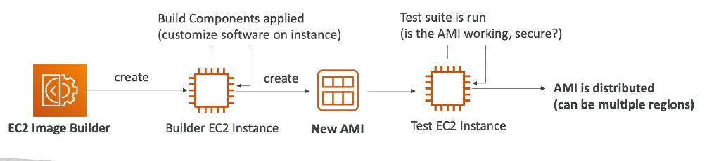

# EC2 Image Builder

-EC2 Image Builder is an AWS service that helps you automatically create, customize, and maintain machine images (like virtual machine templates).

- Instead of manually spinning up an EC2 instance, installing dependencies, and taking a snapshot to create an Amazon Machine Image (AMI), Image Builder allows you to create an automated CI/CD pipeline specifically for your AMIs and Docker container images.
- Free service ( Only pay for the underlying resources used to build and store your images).

Here is the standard workflow of an Amazon EC2 Image Builder pipeline, broken down into five key stages:

1. **Base Image Selection:** The process begins by choosing a foundation. This is usually a clean, AWS-provided operating system (like Ubuntu, Amazon Linux, or Windows Server) or an existing custom image you want to update.
2. **Build Phase (Applying Components):** AWS launches a temporary "builder" EC2 instance. It then executes your custom components—which are scripts or configuration files—to install software, apply security patches, and lock down system settings.
3. **Automated Testing:** Once the build is complete, Image Builder creates a new temporary "test" instance from the freshly built image. It runs predefined tests to verify that the software functions correctly and that no security vulnerabilities were introduced.
4. **Distribution:** If the image passes all tests, it is finalized as a new Amazon Machine Image (AMI) or container image. It is then automatically copied to your designated AWS Regions, shared with specific AWS accounts, or pushed to Amazon ECR.
5. **Lifecycle & Deployment:** The new, approved "golden" image is ready for production. Your Auto Scaling Groups or Launch Templates can begin using it to spin up new servers, while Image Builder automatically terminates the temporary builder and test instances.
