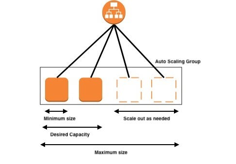

# Scaling Groups

<!-- image -->

## Steps to create a scaling group with a load balancer

1. Create a launch template 
  -  AMI (can be a user own AMI or AWS provided AMI)
  -  Instance type
  -  Security group
  -  Key pair
2. Create a scaling group 
3. Create a load balancer
4. Create a target group (empty target group)
5. Edit the loadbalcer settings in scaling group

## Min, Max and Desired Capacity

- Min Capacity: The minimum number of instances that should always be running.
- Max Capacity: The maximum number of instances that can be running.
- Desired Capacity: The number of instances that we want to run. can be scale in or scale out.