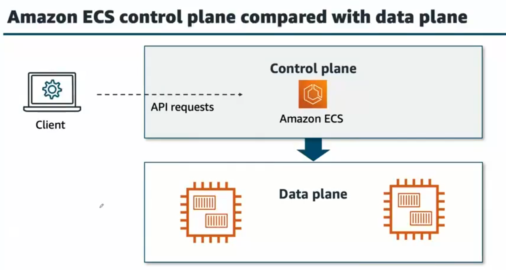
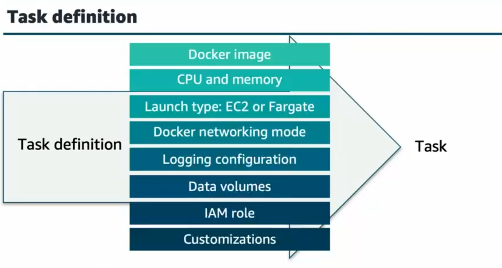

## Elastic Container Service (ECS)

### Task

- **Describe a container**

### Service

In this context, a service is a configuration that you can use to run and maintain a specified number of tasks simultaneously in a cluster.

