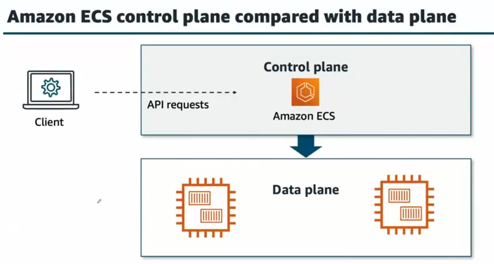
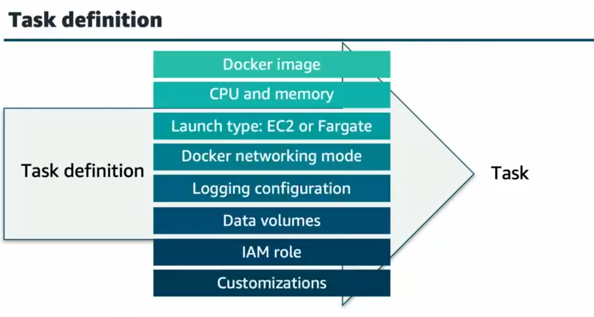

## Elastic Container Service (ECS)

- can run container on either EC2 or Fargate
- ec2 - you manage the cluster of EC2 instances that run the containers
- fargate - you don't have to manage the underlying infrastructure, and you can focus on building and running your applications. serverless

### Task

- **Describe a container**

### Service

- In this context, a service is a configuration that you can use to run and maintain a specified number of tasks simultaneously in a cluster.
- support auto-scaling, load balancing, and rolling updates.
