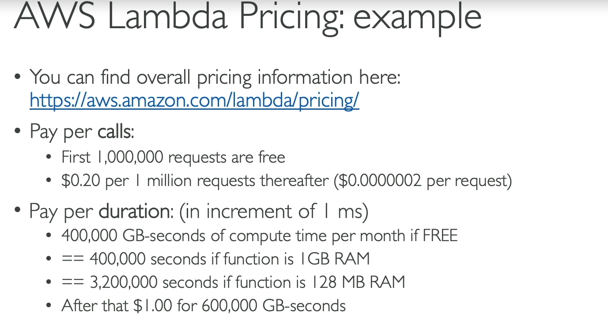

# AWS lambda

- serverless
- support many languages (python, nodejs, java, go, c#, ruby, custom runtime)
- you can run code without provisioning or managing servers
- ways to create lambda functions:
  - from console (code editor)
  - Zip file upload
  - container image (ECR)
- Cold start: when a lambda function is invoked for the first time, or after it has been idle for a while, it may take some time to start up. This is because AWS needs to allocate resources and initialize the execution environment for the function. This can lead to increased latency for the first invocation.
- To mitigate cold start issues, you can:
  - Keep your Lambda functions warm by invoking them periodically (e.g., using CloudWatch Events).
  - Use provisioned concurrency to keep a specified number of instances of your function initialized and ready to respond to invocations.
  - Optimize your function's code and dependencies to reduce startup time.
- Can integrate with EventBridge (formerly CloudWatch Events) to schedule functions to run at specific times or intervals. (like a cron job)

