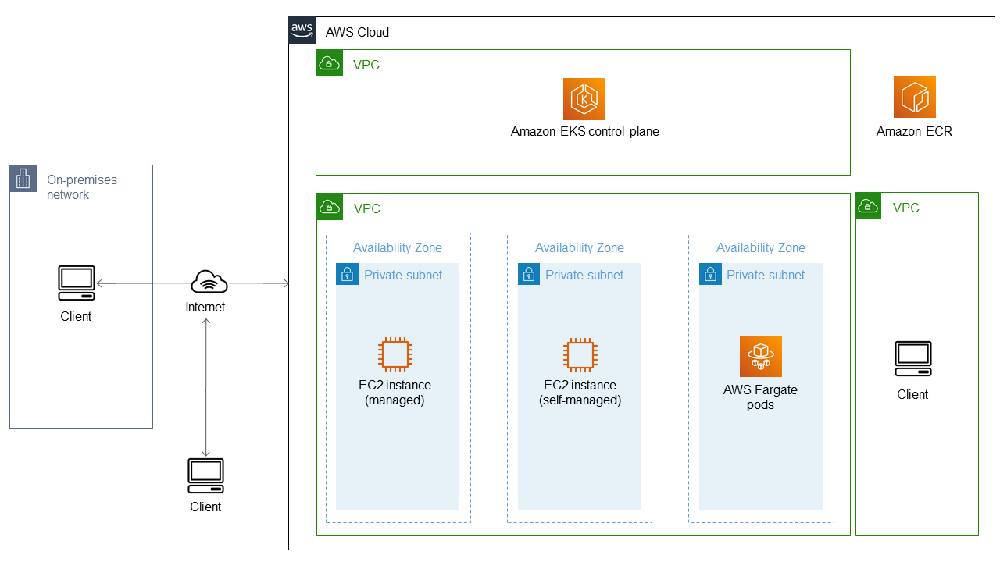

# EKS

## Network

- The EKS control plane runs in multiple AZs (managed by AWS).
- Your single worker node runs in one subnet (one AZ).
- The cluster still works perfectly — just no redundancy at the node level.

### EKS control plane does not run inside the VPC that you create.

- It runs in an AWS-managed VPC, separate from your own.
- However…
  - AWS automatically connects your VPC to the control plane using Elastic Network Interfaces (ENIs) placed in your subnets.
  - So your cluster feels like one integrated system, even though control plane and worker nodes are in different networks.
