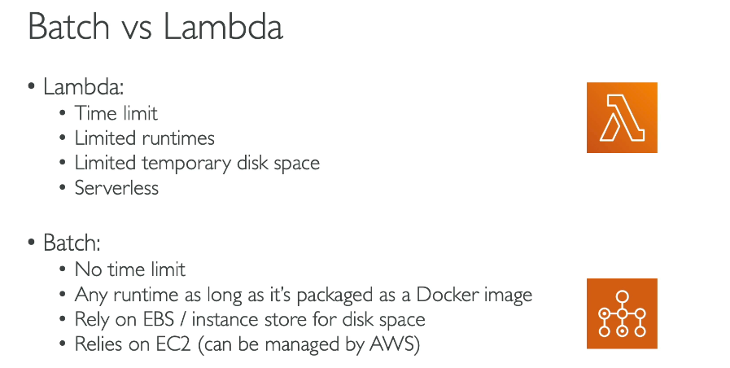

# AWS Batch

- easily and efficiently run hundreds of thousands of batch computing jobs on AWS.
- AWS Batch dynamically provisions the optimal quantity and type of compute resources (e.g., CPU or memory-optimized instances) based on the volume and specific resource requirements of the batch jobs submitted.
- You don't have to install or manage batch scheduling software. AWS Batch handles the heavy lifting of provisioning, managing, and monitoring.

## Key Concepts

- Jobs: The unit of work submitted to AWS Batch (e.g., a shell script, a Linux executable, or a Docker container image).
- Job Definitions: Think of this as the blueprint for your job. It specifies how jobs are to be run, including the Docker image to use, IAM roles, required memory and CPU, environment variables, and mount points.
- Job Queues: When you submit a job, it goes into a job queue where it resides until it is scheduled onto a compute environment.
- Compute Environments: These are the actual underlying AWS resources that execute your jobs. Managed environments can utilize Amazon EC2 instances, Amazon ECS, or AWS Fargate (serverless compute)

