# S3 (Simple Storage Service)

### S3 service is Region specific

### S3 is a flat structure, no folders

### Total S3 bucket size is unlimited, but each object can be up to 50TB

## S3 bucket namespace

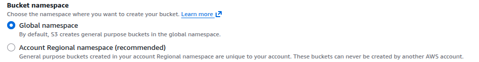

1. Global Namespace - The traditional model where your bucket name must be unique across all AWS accounts in the world. If another user has already claimed the name my-app-logs, you cannot use it.

2. Account-Regional Namespace - This new option allows bucket names to be unique only within your specific AWS account and region. This means you can now use simple, predictable names like logs or backups in multiple regions or accounts without competing for them globally

## S3 Security

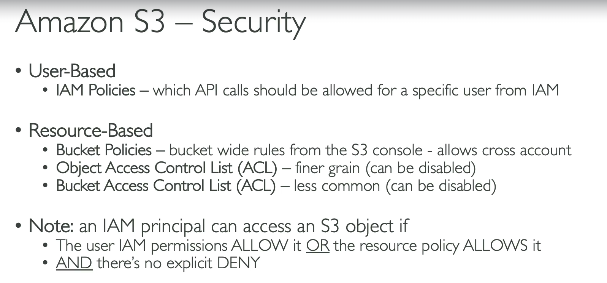

### Bucket policy

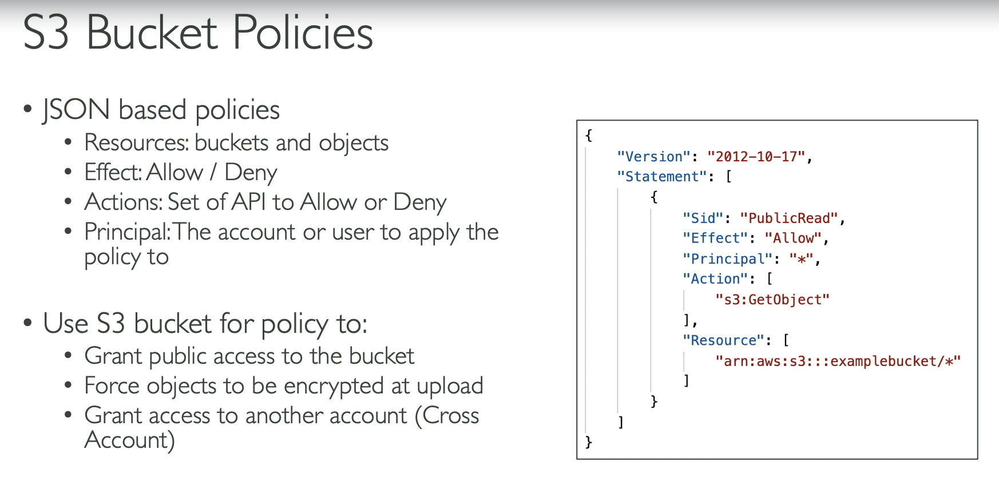

Examples:

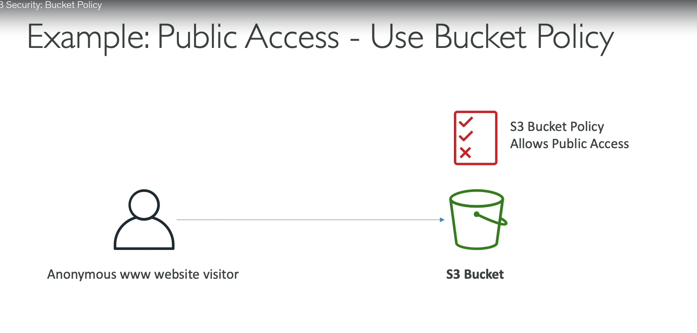
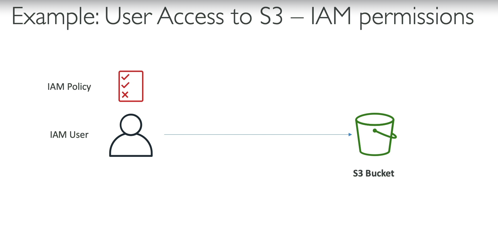
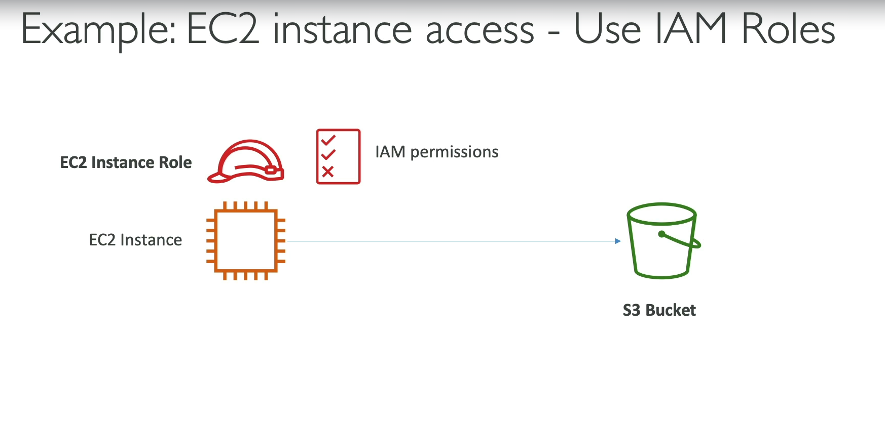
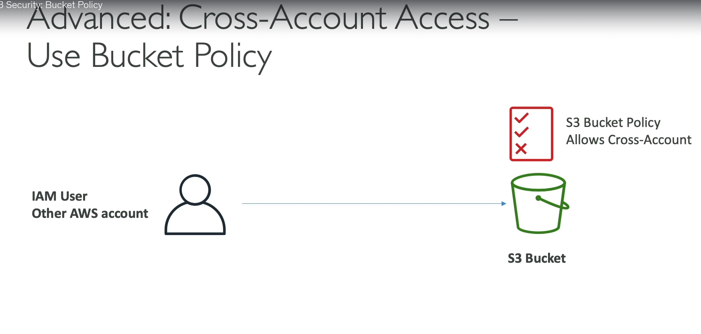

### To host a static website on S3

- Bucket need to public
- Objects need to be public

### S3 public access

- Uncheck Block Public Access
- This is not enough, you also need to set bucket policy or object ACL to public

---

## S3 Objects

- Objects are the fundamental entities stored in S3, consisting of data and metadata.
- The Anatomy of an Object
  - Key: The unique identifier for the object within a bucket. (name or path)
  - Value: The data that is stored in the object.
  - Version ID: A unique identifier for each version of an object (if versioning is enabled).
  - Tags: Key-value pairs that can be used to categorize and manage objects.
  - Metadata: Additional information about the object, such as content type, size, and custom metadata.

---

## S3 versioning

- S3 Versioning keeps multiple versions of the same object in a bucket, helping you recover old files if someone overwrites or deletes a file.
- Uploading a file with same name replaces the old file. With versioning s3 keep both files with different versions
- With versioning enabled, deleting a file will not remove it, instead it will add a delete marker to the object

---

## S3 Replication (CRR and SRR)

- Cross-Region Replication (CRR): Automatically replicates objects from a source bucket in one AWS region to a destination bucket in another AWS region. This is useful for disaster recovery, compliance, and latency reduction.
- Same-Region Replication (SRR): Automatically replicates objects from a source bucket to a destination bucket within the same AWS region. This can be used for data backup, log aggregation,or live replication between production and staging environments.
- Buckets can be in different accounts
- asynchronous process, there is a delay between source and destination buckets

---

## Storage Classes

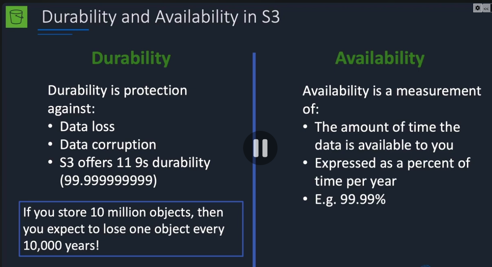

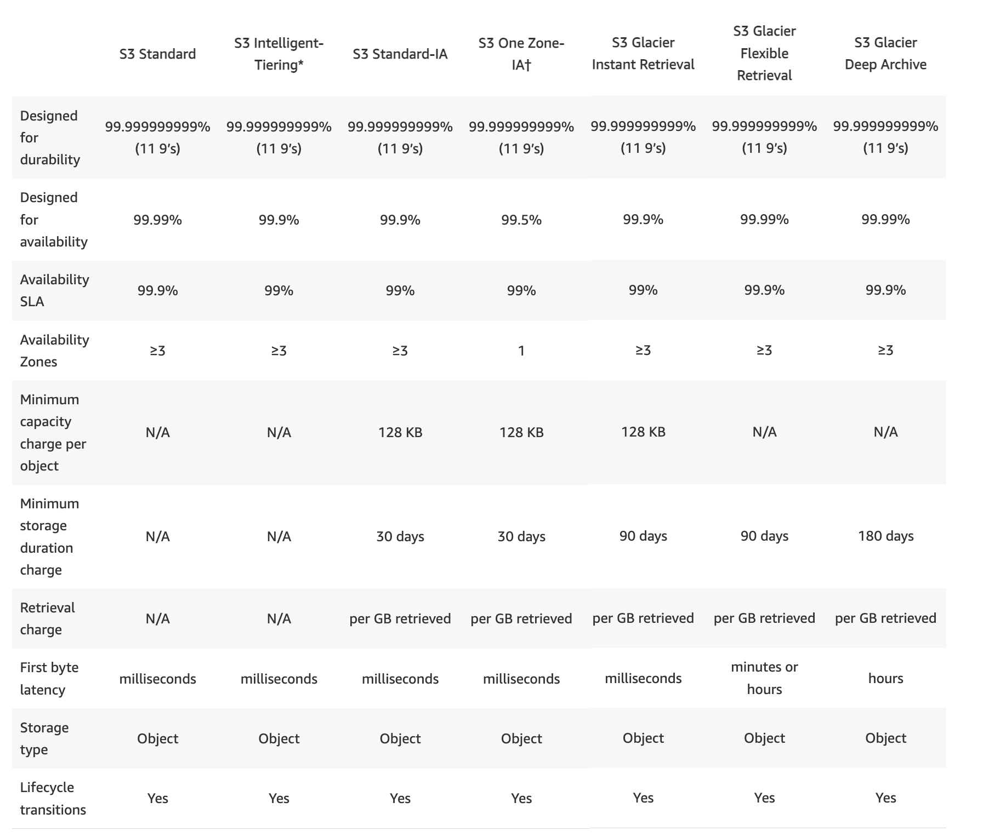

### Storage class is assigned to objects, not buckets

we can add lifecycle rules to automatically transition objects to different storage classes based on age or other criteria.

---

## Directory s3 Bucket with Express One Zone storage class

- Saved data in one AZ, so if that AZ goes down, data is not available until the AZ is back up
- Cheaper than standard storage class, but less available
- Suitable when compute resources and s3 storage must be in the same AZ
- low latency access to data is required

---

## S3 Encryption

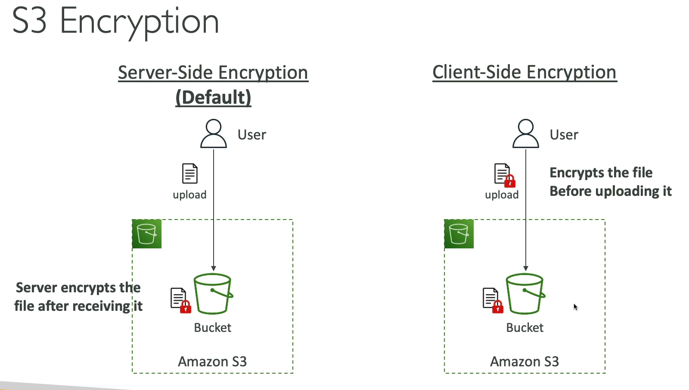

### Server-Side Encryption (SSE)

- This is the default behavior for S3. In this model, Amazon S3 manages the encryption process for you.
- Amazon S3 encrypts the data before saving it to the disk in its data centers.
- When you retrieve the data, Amazon S3 decrypts it and returns it to you in its original form.

### Client-Side Encryption (CSE)

- the responsibility for security shifts entirely to you (the user/application).
- You encrypt the data locally on your own machine or application server before it is ever sent to AWS.
- Amazon S3 receives an already encrypted "blob." It has no idea what the content is and does not have the keys to decrypt it. S3 simply stores it as-is.
- You must download the encrypted file and decrypt it locally using your own decryption logic and keys.

---

## IAM access analyzer for S3

- IAM Access Analyzer for S3 helps you identify and understand the access permissions of your S3 buckets and objects.
- It analyzes the bucket policies, access control lists (ACLs), and other permissions to determine who has access to your S3 resources and what actions they can perform.
- It provides insights into potential security risks, such as public access or cross-account access, and helps you take corrective actions to secure your S3 data.

---

## Shared responsibility model for S3

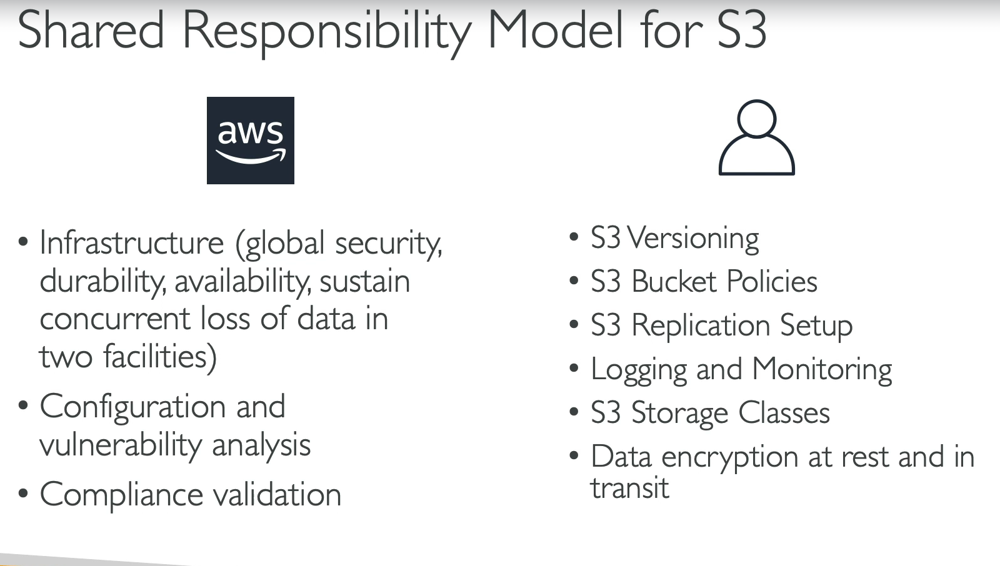

## AWS snowball

- AWS Snowball is a data transfer service that helps you move large amounts of data into and out of AWS using physical storage devices.
- AWS sends you a Snowball device. You can connect the Snowball device to your local network and transfer your data onto it.
- Once the data transfer is complete, you ship the Snowball device back to AWS, where they will upload the data to your specified S3 bucket.
- 🛑 Suitable for transferring large datasets (up to petabytes) that would be time-consuming or costly to transfer over the internet, especially in cases of limited bandwidth or unreliable connectivity.

## AWS Snowball Edge

- AWS Snowball Edge is an extension of the Snowball service that provides additional compute capabilities along with data transfer.
- AWS sends you a Snowball Edge device. You can use it to transfer data to and from AWS, as well as run edge computing workloads directly on the device.
- Snowball Edge devices can be used in remote locations or environments with limited connectivity, allowing you to process and analyze data locally before transferring it to AWS.

---

## AWS storage gateway

- AWS Storage Gateway is a hybrid cloud storage service that enables on-premises applications to seamlessly use AWS cloud storage.
- It provides a bridge between your on-premises environment and AWS, allowing you to store data in the cloud while still maintaining low-latency access to it from your local applications.
