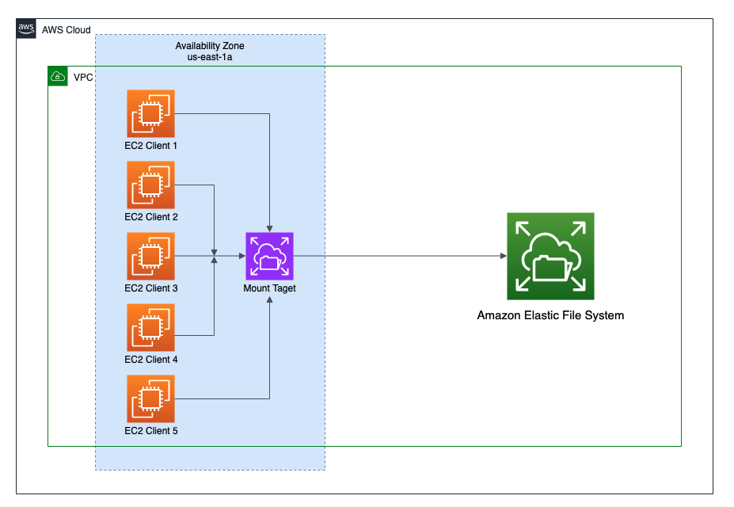
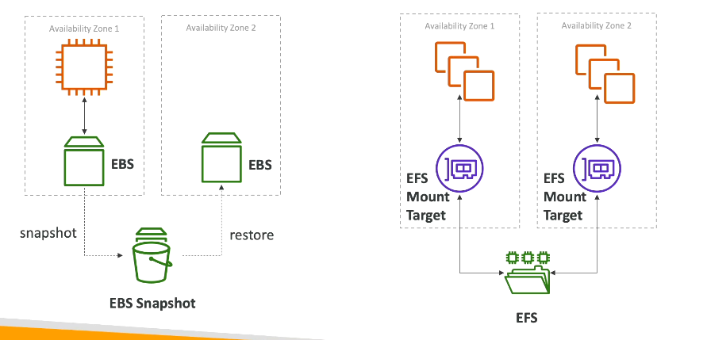

## EFS (Elastic File System)

### File system that can mount on multiple EC2 instances

- **EFS is a Regional service**: Data is stored across multiple AZs within a region, providing high availability and durability.
- Most suitable for Linux based ec2 instances, But can be used with Windows instances using NFS client software.
- Best way for windows instances to have a network file system is to use FSx for Windows File Server, which provides a fully managed native Windows file system.
- EFS is not accessible over public internet directly
- Can be accessed from on-premises data centers using AWS Direct Connect or VPN connections (site-to-site VPN or client VPN)

<!-- add a image --> imge

## EBS vs EFS

