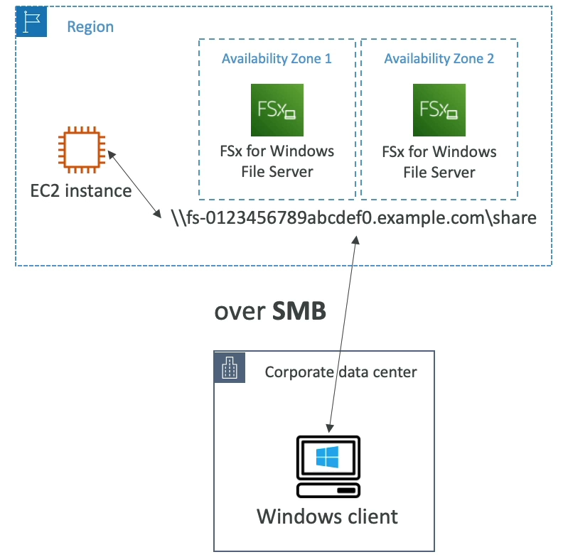
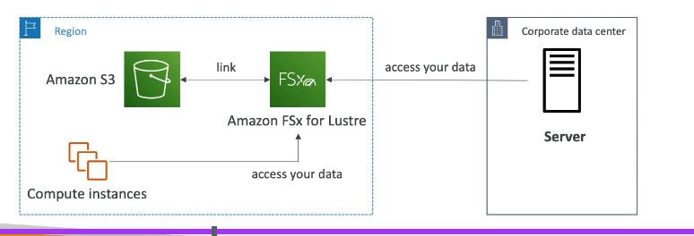

# FSx

- AZ specific
- Just like EFS, to connect to on premises data centers, you can use AWS Direct Connect or VPN connections (site-to-site VPN or client VPN)
- FSx for Windows File Server provides a fully managed native Windows file system, which is ideal for Windows-based applications that require shared file storage. - It supports SMB protocol and integrates with Active Directory for authentication and access control.
- FSx for Lustre is designed for high-performance computing (HPC) workloads that require fast storage with low latency. It is optimized for workloads such as machine learning, big data analytics, and media processing. It supports the Lustre file system, which is a popular choice for HPC(High Performance Computing) applications.

## FSx for windows file server

## FSx for Lustre

