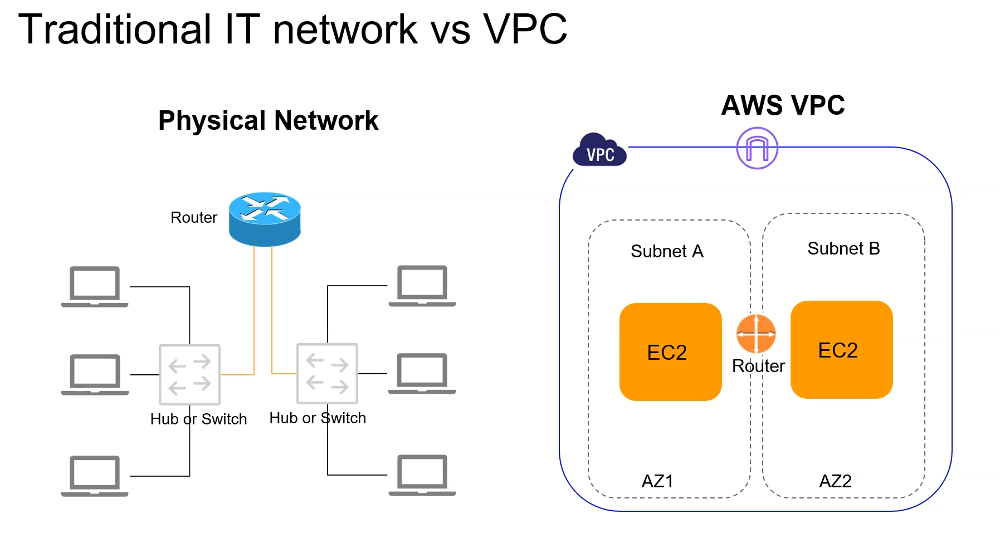
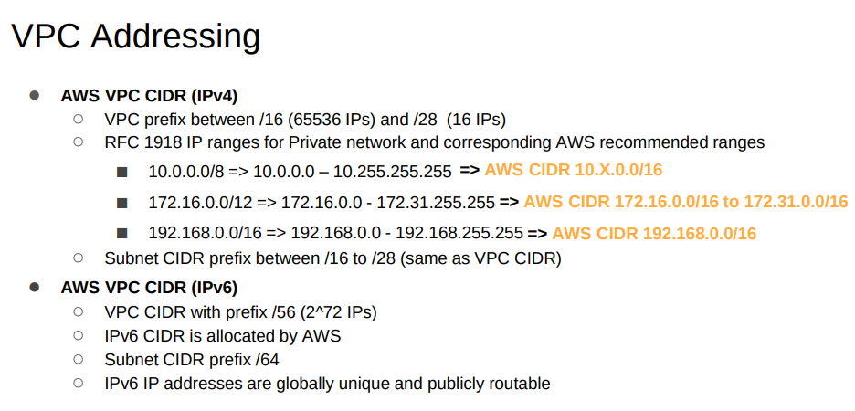
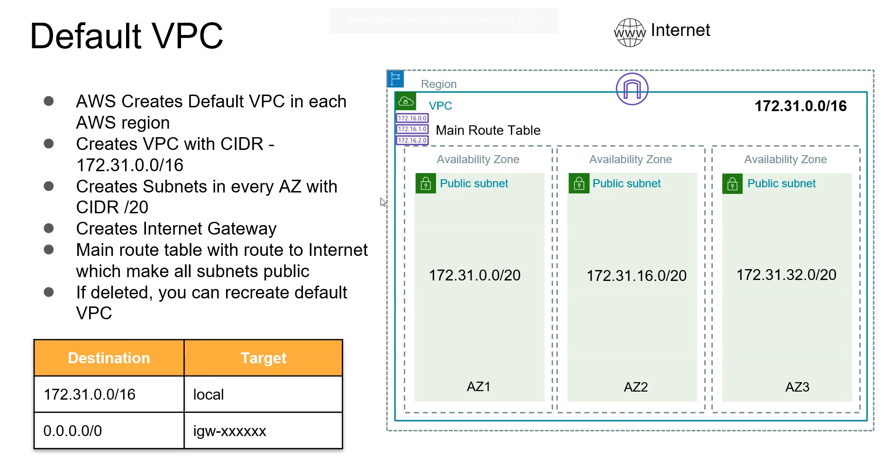

# VPC

- A VPC (Virtual Private Cloud) is your private network inside AWS where you run servers.

## VPC scope with respect to other services

### **🛑 VPC is region specific**

### **🛑 Subnets are AZ specific**

---

### 🛑 In aws ip address are added to the Elastic Network Interface (ENI) not to the instance directly

---

## Default VPC

