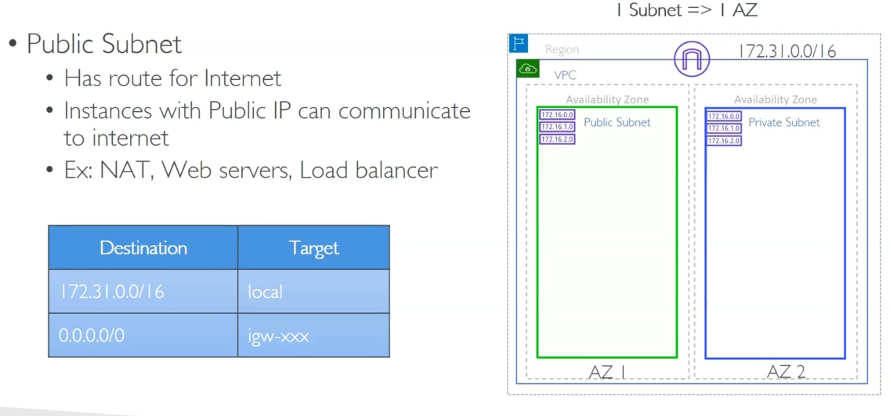
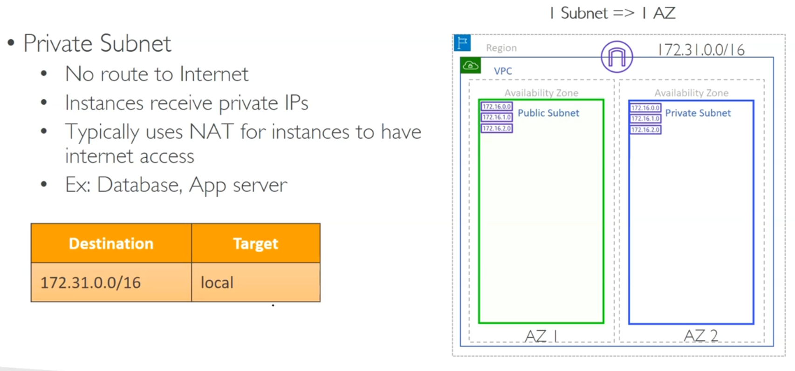
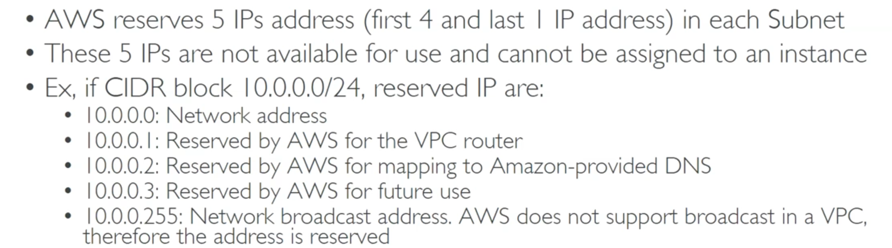
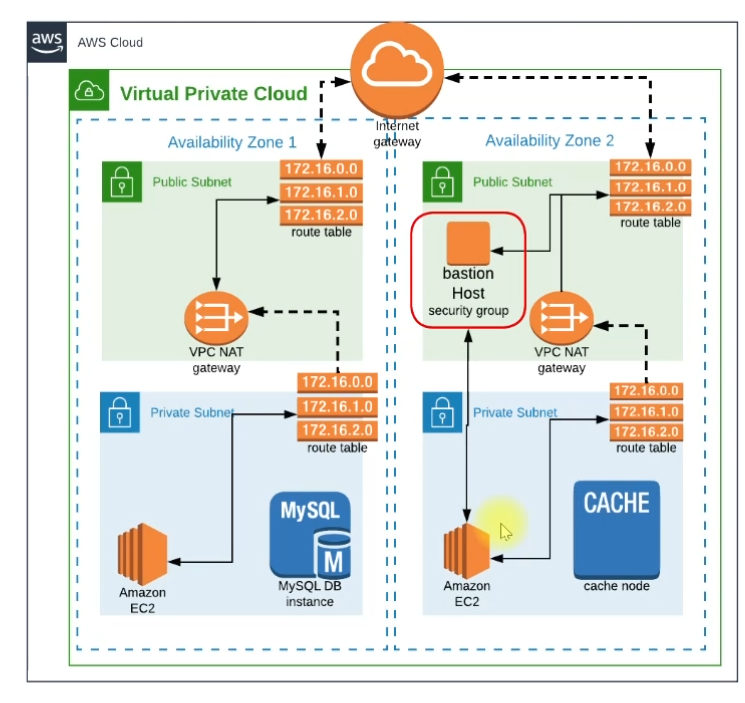

# Subnets

- A subnet splits the VPC IP range into smaller sections.
- smaller network inside VPC

### Subnets are avalability zones specific

## public subnet

## private subnet

### 5 addresses are reserved in each subnet

## Bastion Host

**A bastion host (also known as a jump server) is a special-purpose server designed to act as a secure gateway between an external network (like the internet) and an internal network.**

- **A bastion host serves as a controlled entry point for administrators to securely connect to internal resources (e.g., EC2 instances, databases, or private subnets).**

## Why use subnets

1. Network Organization - Without subnets everything would be in one big network, which becomes messy and insecure.
2. Security Isolation - Subnets help control which machines can access the internet. (public vs private subnets)
3. Different Routing Rules - Each subnet can have its own route table.A route table decides where network traffic goes.
