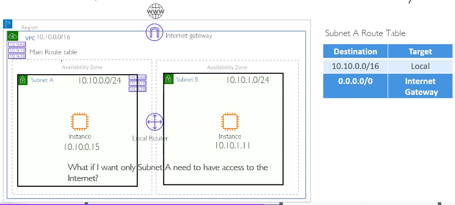

# Route tables

## Main route table

- **Each VPC has a main route table that is automatically created when the VPC is created.**
- **If subnets have no explicit route table associated with them, they use the main route table.**
- **Main route table enable traffic between subnets within the VPC by default.**
- **Main route table also enables traffic to and from the internet if the VPC has an internet gateway attached and a route to the internet gateway is present in the main route table.**

| Destination | Target | Description                                                                                                 |
| ----------- | ------ | ----------------------------------------------------------------------------------------------------------- |
| 10.0.0.0/16 | local  | 😀 If the traffic send to a address in the VPC sent them to local router (This enable inter subnet traffic) |
| 0.0.0.0/0   | igw    | 😀 If the traffic is destined for an address outside the VPC, it is sent to the internet gateway            |

## Custom route table

- **You can create custom route tables to control the routing for specific subnets within your VPC.**
- **Custom route tables can be associated with one or more subnets, allowing you to define**
- **Custom route table is overrides the main route table for the associated subnets.**
- **But still if a subnet is not explicitly associated with a custom route table, it will use the main route table.**

 
 

## Inbound Traffic (the Subtle Part)

- 🛑 Inbound traffic from the internet is not controlled by the route table. Instead:
- 🛑 The Internet Gateway (IGW) is stateful.

### Inbound traffic sending as a response to an outbound request:

- **If an instance in Subnet A sends a request to the internet, the IGW remembers that connection and automatically allows the return traffic back in.**

### Inbound traffic not initiated by an outbound request:

For unsolicited inbound traffic (like an internet client trying to reach your EC2’s public IP):

- **The IGW sees the packet destined for the instance’s public IP.**
- **IGW checks if there is a valid route _`back`_ to the instance’s subnet.**
- **If the subnet does not have 0.0.0.0/0 → The inbound packet gets dropped**
- **It knows how to map that to the private IP in Subnet A.**
