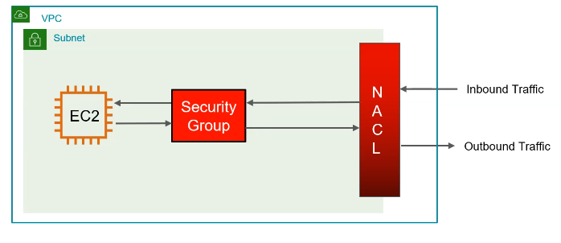

# Firewalls in VPC

There are main 2 types of firewalls in VPC:

- Security Groups
- Network ACLs

## Security Groups

- **Stateful**: If you allow an incoming request, the response is automatically allowed regardless of outbound rules.
- Operate at the instance level.
- Support allow rules only.
- Cannot block specific IP addresses, only allow specific IP addresses.
- Can attach multiple security groups to one instance.

## Inbound Rules

- **🛑 For returning inbound traffic, inbound rules are not evaluated. Instead, the return traffic is allowed automatically if the original request was allowed.**
- In inbound rules, we only focus on the traffic that is coming from outside to the instance.
- By default, all inbound traffic is blocked.

## Outbound Rules

- **🛑 For returning outbound traffic outbound rules are not evaluated. Instead, the return traffic is allowed automatically if the inbound rule for the original request was allowed.**
- In outbound rules, we only focus on the traffic that send from the instance to the outside world not the returning traffic.
- By default, all outbound traffic is allowed.
