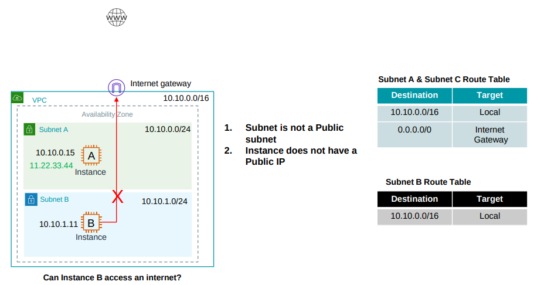
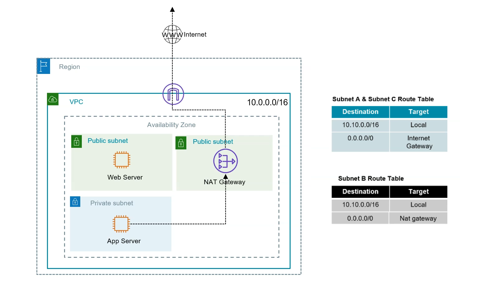
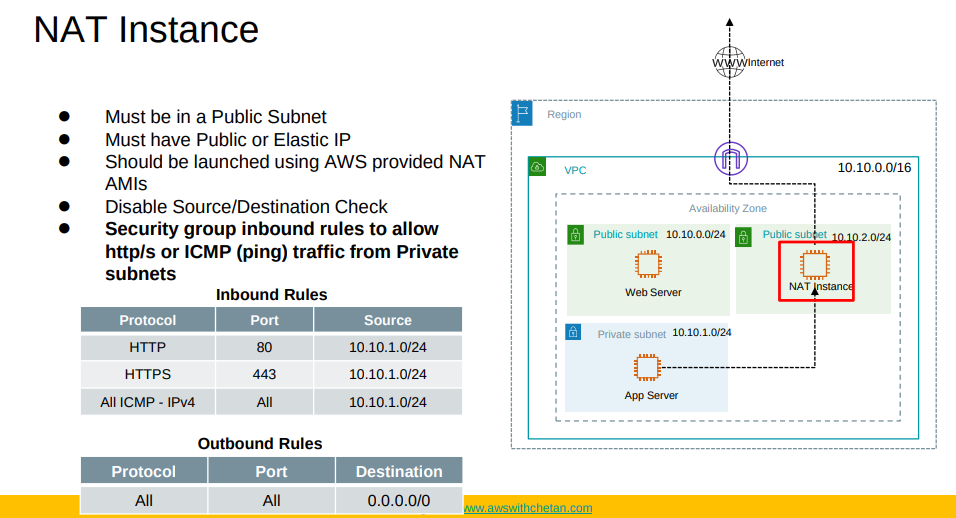

# NAT Gateway

## Subnet B is a private subnet, can not access the internet directly

- For security reasons, we want to isolate the resources in Subnet B from direct internet access.
- But still want to allow resources in Subnet B to access the internet for updates, patches, etc.

## Solution: NAT Gateway

- NAT gateway acts like a home router, allowing multiple devices to share a single public IP address for outbound internet access.
- Still access from the internet to resources in Subnet B is blocked because the NAT gateway does not allow inbound connections initiated from the internet.
- For AWS managed NAT gateway, there are no security groups to configure, it is configured to allow all outbound traffic by default. But ACL at subnet level applies.

## NAT Instances

- NAT instances are EC2 instances configured to forward traffic to the internet.
- They can be used as an alternative to NAT gateways.
- Cost less than NAT gateways for low traffic scenarios.
- Security groups can be applied to NAT instances.

