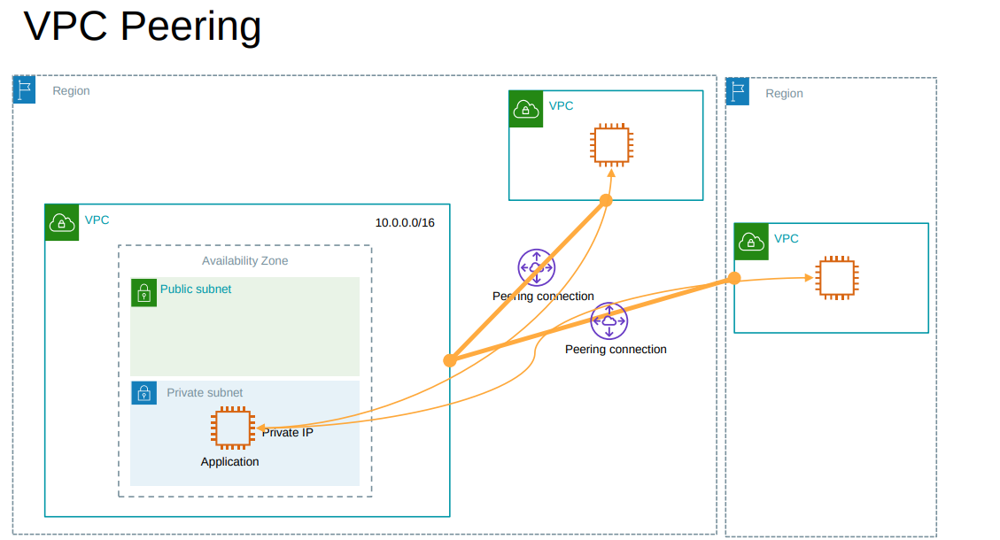
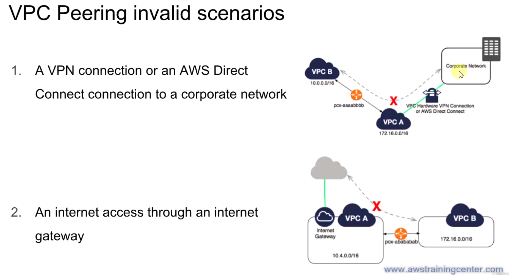
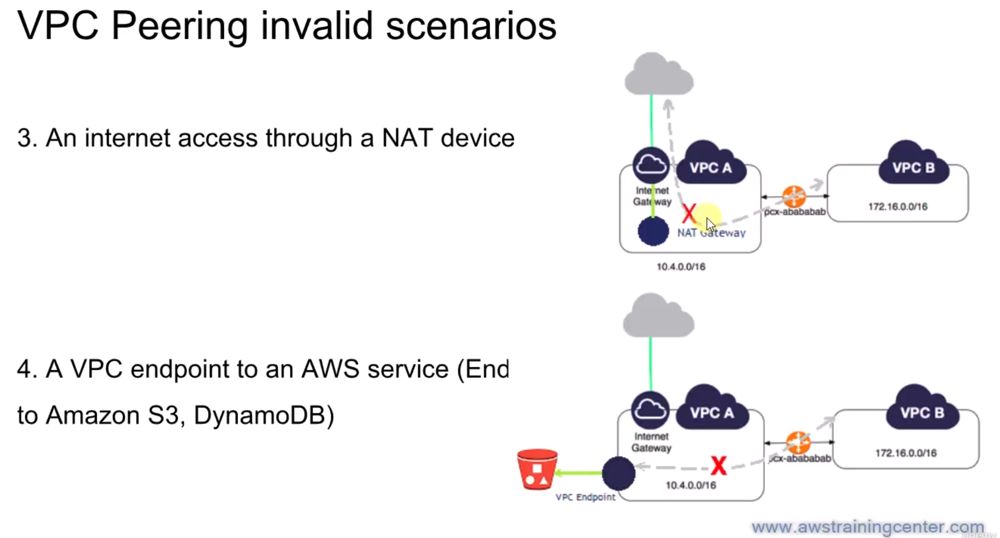

# VPC Peering

- A networking connection between two VPCs that enables you to route traffic between them using private IPv4 or IPv6 addresses.
- Instances in either VPC can communicate with each other as if they are within the same network.
- You can create a VPC peering connection between your own VPCs, or with a VPC in another AWS account within the same region or across regions.

- VPC CIDR should not overlap.
- not transitive (A-B and B-C does not mean A-C).

### Invalid Peering Example

## Steps to Create VPC Peering

- Create a VPC peering connection.
- Accept the VPC peering connection.
- Update route tables for both VPCs to enable routing of traffic between them.
