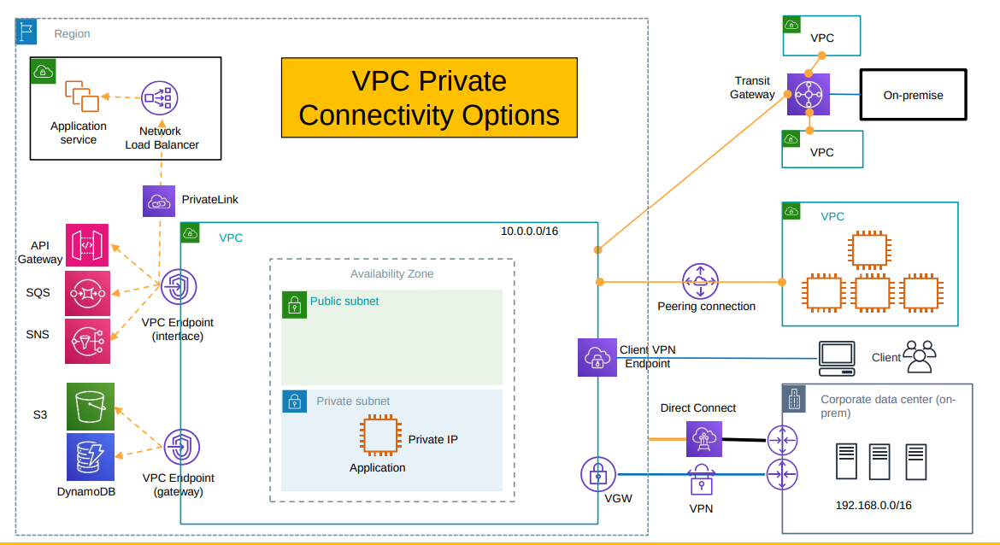
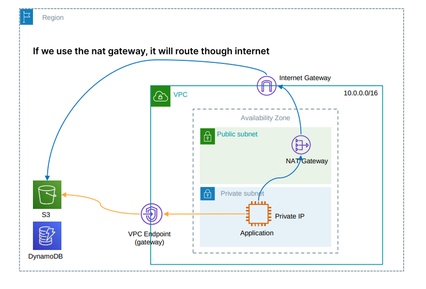
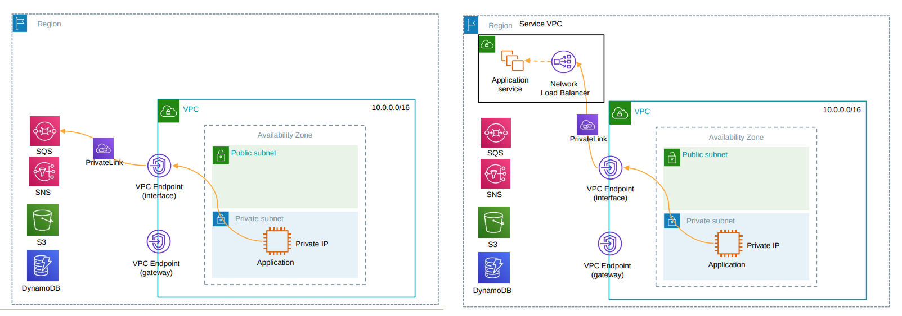
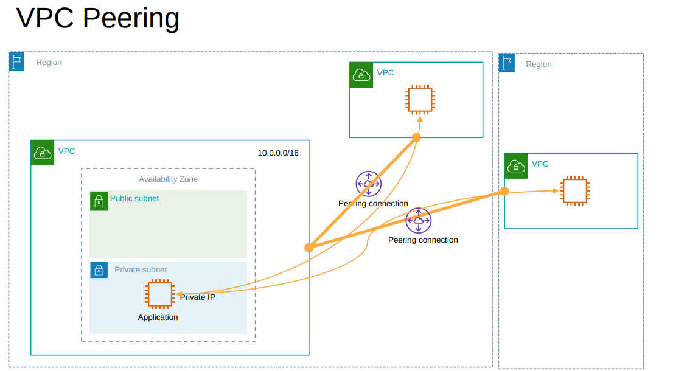
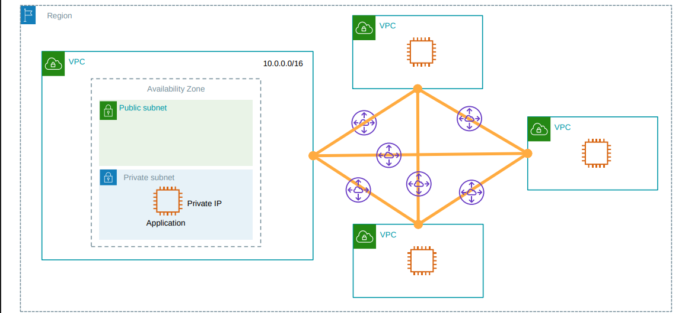
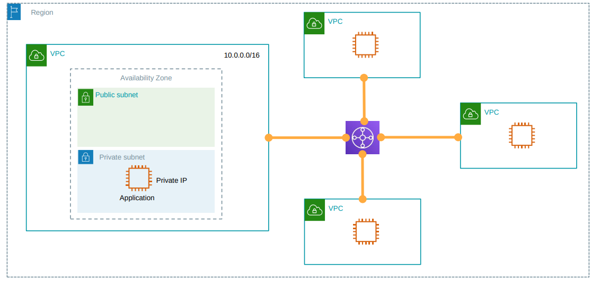
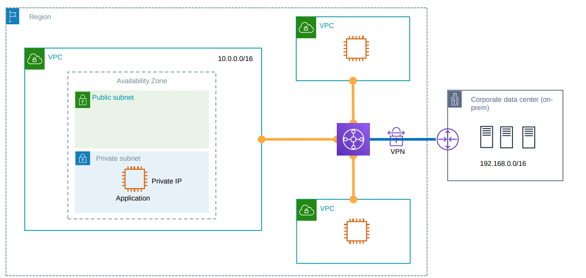
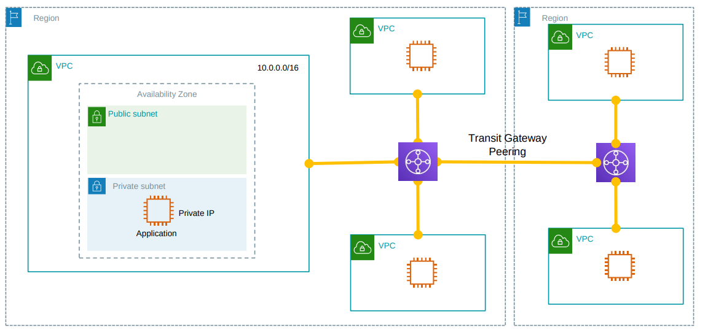
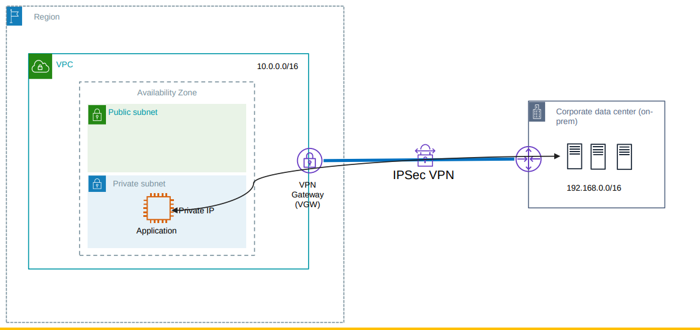
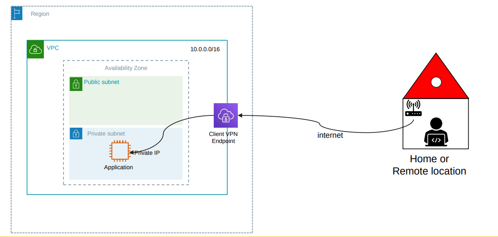

# VPC private connectivity

## VPC Endpoints

### Gateway Endpoint

- Works only for S3 and DynamoDB.
- **Adds a route to the route table of the subnet.**
- Free of cost.
- Traffic does not leave the Amazon network.

### Interface Endpoint (powered by AWS **PrivateLink**)

- Works for many AWS services (e.g., EC2, SSM, SNS, SQS, KMS, etc.) and also for your own services or third-party services.
- **Creates an elastic network interface (ENI) in your subnet with a private IP address.**
- Charged based on the hours the endpoint is provisioned and the amount of data processed.
- Traffic does not leave the Amazon network.

---

## VPC Peering

- A networking connection between two VPCs that enables you to route traffic between them using private IPv4 or IPv6 addresses.
- Instances in either VPC can communicate with each other as if they are within the same network.
- You can create a VPC peering connection between your own VPCs, or with a VPC in another AWS account within the same region or across regions.

---

## AWS Transit Gateway

- A network transit hub that you can use to interconnect your VPCs and on-premises networks.
- Before TGW, if you needed multiple VPCs to talk to each other, you used VPC Peering. However, with many VPCs, the connections grow exponentially.

- With TGW, you create a star topology with the TGW in the center. This simplifies management and scales better.

### Transit Gateway VPN Attachment

- A Transit Gateway VPN Attachment connects your on-premises network (via a Site-to-Site VPN) to your AWS Transit Gateway (TGW).
- This allows your on-premises environment to reach multiple VPCs through a single, centralized VPN connection, instead of maintaining separate VPNs for each VPC.

### Transit Gateway Peering

- A Transit Gateway Peering Attachment connects two Transit Gateways (TGWs) in different AWS Regions.
- This allows resources in VPCs attached to one TGW to communicate with resources in VPCs attached to the other TGW, enabling cross-region connectivity.

---

## Site-to-Site VPN

- A Site-to-Site VPN connection enables you to securely connect your on-premises network or branch office site to your Amazon Virtual Private Cloud (VPC).
- The connection is established over the public internet and uses IPsec (Internet Protocol Security) to encrypt the data transmitted between the two networks.
- After connection, instances in the VPC can communicate with resources in your on-premises network as if they are within the same network.

---

## Client-to-Site VPN (AWS VPN Client)

- A Client-to-Site VPN connection enables you to securely connect individual users to your Amazon Virtual Private Cloud (VPC) from remote locations.
- The connection is established over the public internet and uses SSL/TLS (Secure Sockets Layer/Transport Layer Security) to encrypt the data transmitted between the user's device and the VPC.
- After connection, users can access resources in the VPC as if they are within the same network.

---

## AWS Direct Connect

- A cloud service solution that makes it easy to establish a dedicated network connection from your premises to AWS.

