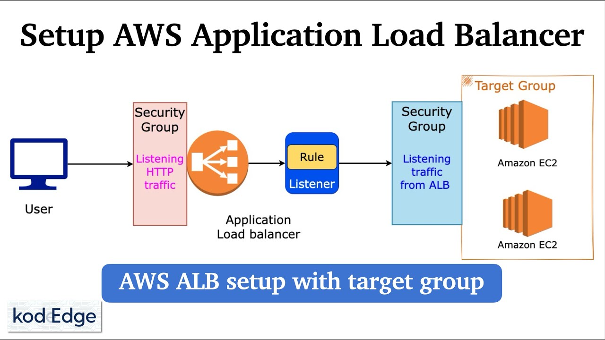
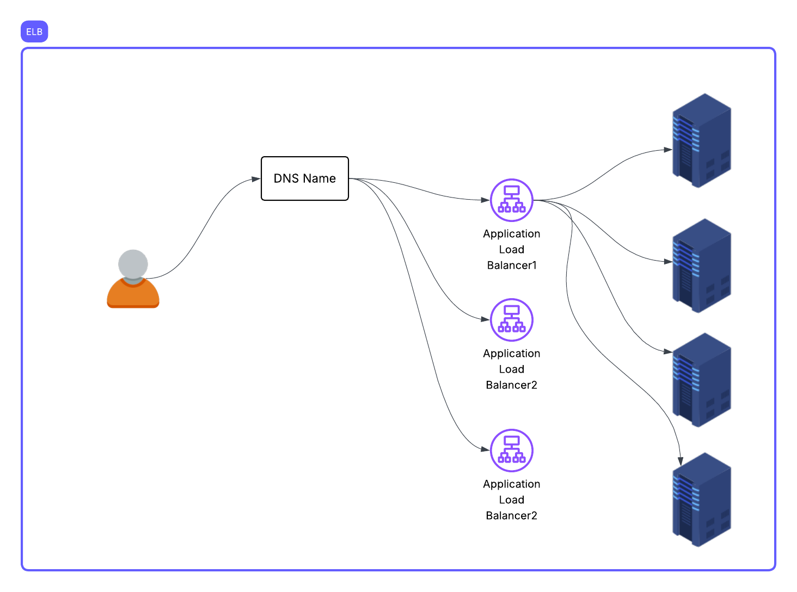

##ELB

## types of ELB

- **Classic Load Balancer**: layer 4 (TCP) and layer 7 (HTTP/HTTPS) .

- **Application Load Balancer**: layer 7 (HTTP/HTTPS), load balancing of HTTP traffic.

- Works at Layer 7 (HTTP/HTTPS)
- Can route based on:
  - URL path (/api)
  - Hostname (app.example.com)
  - Headers
  - Source IP
  - Query parameters



- **Network Load Balancer**: Operates at layer 4 (TCP),millions of requests per second, ultra-low latencies.

- **Gateway Load Balancer**: Combines a transparent network gateway with a load balancer.

## ELB architecture



- When you create a load balancer, AWS assigns it a DNS name, not a fixed IP address.
  That DNS name is backed by multiple IPs, each mapping to a load balancer node in different Availability Zones (AZs).

Example:

```bash
$ nslookup myapp-lb-123456789.us-east-1.elb.amazonaws.com
Name: myapp-lb-123456789.us-east-1.elb.amazonaws.com
Addresses: 52.86.10.33
           52.23.91.71
           18.215.112.54
```

- Those IPs are not static — AWS can add or remove them dynamically.
- Each IP points to a load balancer node, and these nodes are managed by AWS in multiple AZs for fault tolerance.


## What is the problem solved by ELB?

- we can use a single ec2 machine to deploy a apllication
- What will happen when the load increases? Server crashing
- We could create multiple ec2 machine but load is not distributed to all
- We can create a ELB in front of these ec2 machines
- ELB will distribute the load to multiple ec2 machines

## ELB and Target Group Port Mapping

### 1. Listener (Frontend)

- The listener port is the port that the client connects to on the Load Balancer.
- We create a listener on that port.
- We add rules to the listener and attach a target group to each rule.

#### Example Rules

```text
If path matches /api/* → forward to API target group
If path matches /web/* → forward to WEB target group
Otherwise → use default rule
```

---

### 2. Target Group (Backend)

- A target group defines:
  - Protocol (HTTP / HTTPS)
  - Default forwarding port
  - Health check configuration

- **The target group port is the default backend port used by the Load Balancer.**

---

## 3. Port Override

When registering targets, we can override the port per target.

Example:

```text
Target Group Default Port: 80

Registered Targets:
- server1:80
- server2:8080
```

- The Load Balancer forwards traffic to the specific port configured for each registered target.

## Why we use Target Groups?

- A Target Group is a logical group of backend servers (EC2, IPs, etc.) that the Load Balancer sends traffic to.
- A configuration object
- Does not have an IP address

Because Target Groups provide:
  - ✅ Health checks
  - ✅ Load balancing between multiple instances
  - ✅ Different routing rules (host-based, path-based)
  - ✅ Easy scaling (add/remove instances without changing LB)