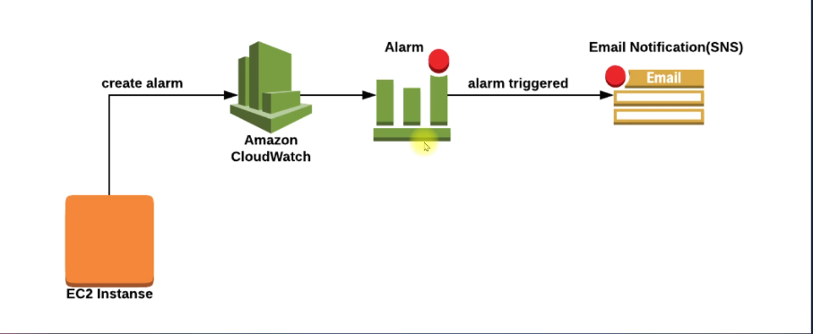
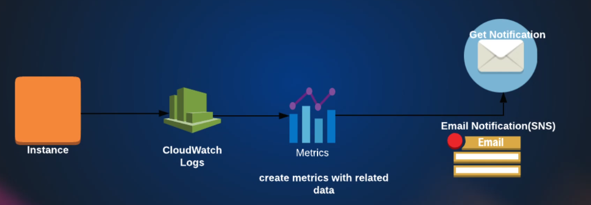

## CloudWatch

### alarm triggered according to the metric in ec2

<!-- image -->

---

### alarm triggered according to the metric in ec2 that was created by us using logs

#### In cloudwatch by default metric check every 5 minutes, but we can change it to 1 minute
