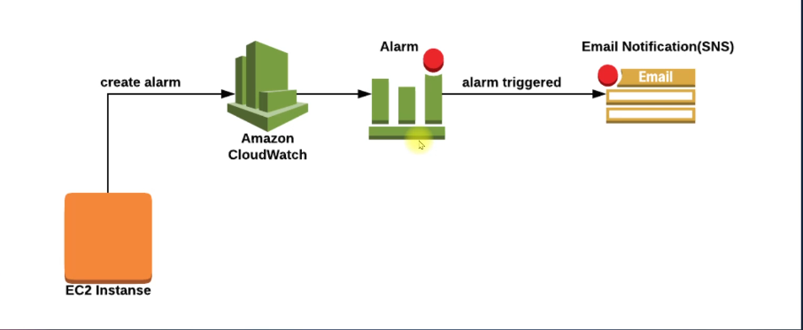
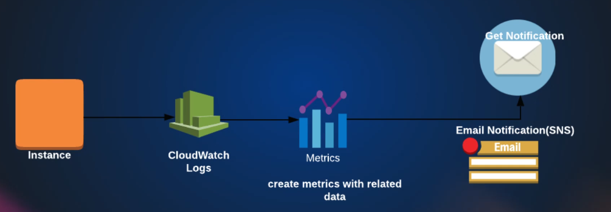

# CloudWatch

- CloudWatch provides metrics for AWS services
- Metric is a variable to monitor
- Metrics belong to namespaces (A namespace is like a folder that groups related metrics.)
- Dimension is an attribute of a metric
  - CloudWatch needs to know which resource the metric belongs to.That is what a dimension does.
  - Up to 30 dimensions per metric

Metric:

```ini
    CPUUtilization = 65%
```

Dimensions:

```ini
    InstanceId=i-12345
    Environment=Production
    Region=ap-south-1
```

- Metrics have timestamps

---

## EC2 Monitoring

### EC2 Basic Monitoring

- By default, every EC2 instance uses Basic Monitoring.
- CloudWatch receives one data point every 5 minutes.

```
12:00 → 20%
12:05 → 22%
```

### EC2 Detailed Monitoring

- Detailed Monitoring is a paid feature.
- CloudWatch now receives a metric every minute.

#### Why does this matter?

Imagine your website suddenly becomes popular.

```
Many users
      ↓
CPU reaches 95%
      ↓
Need another EC2 instance
```

If CloudWatch only updates every 5 minutes:

```
CPU high

(wait 5 minutes)

CloudWatch notices

Auto Scaling launches new server
```

Your users may experience slow performance during those 5 minutes.

With Detailed Monitoring:

```
CPU high

(wait 1 minute)

CloudWatch notices

Auto Scaling launches new server

Scaling begins much sooner.
```

---

## CloudWatch custom metrics

- How do you send a custom metric?
  - AWS provides an API called PutMetricData.
  - An API (Application Programming Interface) is a way for your application to communicate with an AWS service.

### Metric Resolution

- Resolution means how frequently data points are stored.

CloudWatch supports two types.

#### 1. Standard Resolution

One metric every 60 seconds.

#### 2. High Resolution

One metric every 1/5/10/30 seconds.

---

## Cloudwatch Logs

### Log Groups

- Log groups: arbitrary name, usually representing an application
- A Log Group is the highest-level container for logs.
- A log group usually represents:
  - one application
  - one service
  - one Lambda function
  - one Kubernetes workload

### Log Streams

- Inside every Log Group are Log Streams.
- A Log Stream is a sequence of log events from a single source.

Suppose you have:

```
Deployment

xora-server
```

Three pods are running.

```
xora-server

├── pod-a
├── pod-b
└── pod-c
```

CloudWatch Logs might organize them like:

```
Log Group

/xora/server

     │

     ├── pod-a
     ├── pod-b
     └── pod-c
```

Each pod writes to its own Log Stream.

### Log Retention (Expiration Policies)

- Logs consume storage.
- AWS lets you decide how long to keep them.

### Cloudwatch logs can send to other AWS services

- Amazon s3
- Amazon Kinesis Data Firehose
- Amazon Kinesis Data Streams
- AWS Lambda
- OpenSearch Service

### Logs are encrypted at rest, You can use your own KMS key to encrypt the logs.

---

## Cloudwatch Logs Insights

- CloudWatch Logs Insights is a feature of Amazon CloudWatch Logs that lets you search, filter, analyze, and visualize log data using a query language. Think of it as SQL, but for your log files.

---

## Live Tail

- Live Tail is a feature of Amazon CloudWatch Logs that allows you to view log events in real-time as they are generated. It provides a live streaming view of log data, enabling you to monitor and troubleshoot applications and systems more effectively.

---

## CloudWatch Logs Agent & Unified Agent

For virtual servers (EC2 instances, on-premise servers...)

### CloudWatch Logs Agent

- Old version of the agent
- Can only send to CloudWatch Logs

### CloudWatch Unified Agent

- Collect additional system-level metrics such as RAM, processes, etc...
- Collect logs to send to CloudWatch Logs
- Centralized configuration using SSM Parameter Store

---

### alarm triggered according to the metric in ec2

<!-- image -->


---

### alarm triggered according to the metric in ec2 that was created by us using logs



#### In cloudwatch by default metric check every 5 minutes, but we can change it to 1 minute

### Create custom cloud watch logs in ec2

- **Install CloudWatch Agent on EC2 instance**

```bash
sudo yum install -y amazon-cloudwatch-agent
```

- **Create CloudWatch Agent configuration file**

```json
{
  "agent": { "run_as_user": "root" },
  "logs": {
    "logs_collected": {
      "files": {
        "collect_list": [
          {
            "file_path": "/var/log/httpd/access_log",
            "log_group_name": "MyEC2AccessLog",
            "log_stream_name": "{instance_id}-access"
          },
          {
            "file_path": "/var/log/httpd/error_log",
            "log_group_name": "MyEC2ErrorLog",
            "log_stream_name": "{instance_id}-error"
          }
        ]
      }
    }
  }
}
```

- **Start CloudWatch Agent with the configuration file**

```bash
sudo /opt/aws/amazon-cloudwatch-agent/bin/amazon-cloudwatch-agent-ctl \
 -a fetch-config -m ec2 \
 -c file:/opt/aws/amazon-cloudwatch-agent/etc/amazon-cloudwatch-agent.json -s
```

```bash
sudo systemctl status amazon-cloudwatch-agent
```
