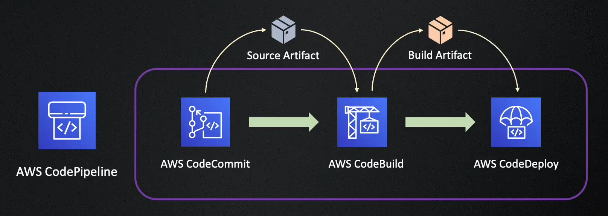
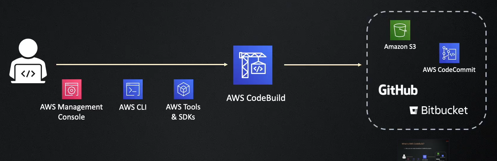
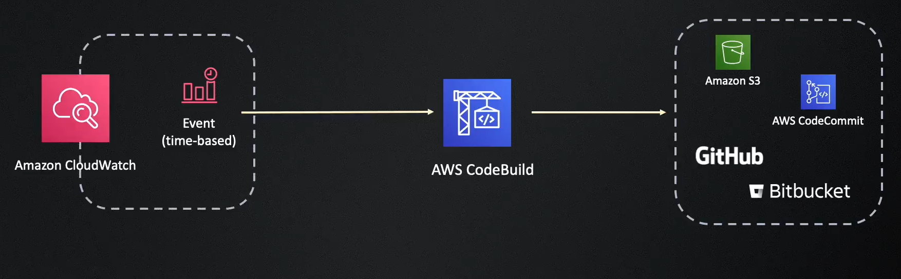

# CodeBuild

- **serverless**
- **Scale on demand**
- **Cost-effective** pay only for the minutes you use, Do not have to pay for idle build servers
- **Acts as a command line in pipelines** - CodeBuild runs your build commands just as you would execute them in a command-line interface, but in an automated and scalable way.
- AWS-provided Docker images (preconfigured for common environments). Custom Docker images from Docker Hub or Amazon Elastic Container Registry (ECR) if you need specific tools or dependencies.
- AWS CodeBuild offers standard Docker images for:
  - Ubuntu
  - Amazon Linux 2
  - Windows Server Core

## BuildSpec File

- A buildspec file is a collection of build commands and related settings, in YAML format, that CodeBuild uses to run a build.
- Can provide buildspec file as
  - part of the source code
  - in codebuild project settings in codebuild console

### Build Phases

- phases:

  - install:

    - Install packages or dependencies required for the build.
    - Runtime versions can be specified here. If not specified, the default runtime versions in the Docker image will be used.

  - pre_build:

    - Commands to run before the main build, such as setting up environment variables.
    - install dependencies if not done in the install phase.
    - signing in to services (e.g., AWS CLI, Docker registry, ECR).

  - build:
    - The main build commands, such as compiling code or running tests.
  - post_build:
    - Commands to run after the build
    - Pushing docker images to a registry
    - Notifying other services about the build status

- **You can define runtimes and versions in the install phase.**, But supported runtimes and versions depend on the Docker image you are using.

## Artifacts

- Artifacts are the output files generated by the build process, such as compiled code, binaries, or packaged applications.
- You can specify the location to store the artifacts, such as an S3 bucket.
- You can also define which files to include or exclude as artifacts using patterns.

---

---

### We can use Codebuild **standalone** or integrate with other AWS services like:

- CodePipeline
- CodeCommit
- S3
- Lambda
- CloudWatch

