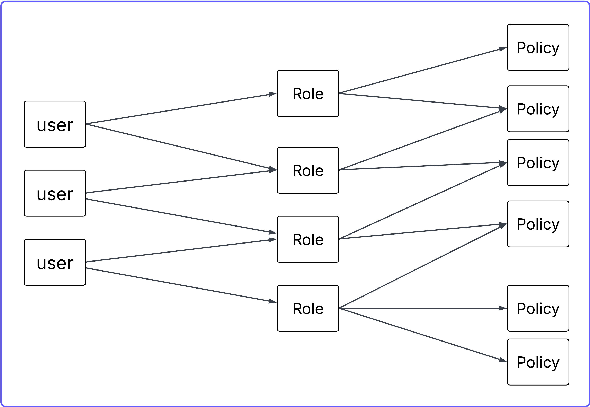

# 🔐 AWS Identity and Access Management (IAM)

IAM is the AWS service that controls:
- **Who** can access your AWS account.
- **What** they can do.
- **Which** resources they can access.
- **From where** and under what conditions.

Think of IAM as the **security guard + permission manager** of your AWS account.

---

## 🧠 Why IAM Exists (Core Problem It Solves)

When you create an AWS account, you get a **Root User** with full admin access. Using the root user daily is dangerous. IAM allows you to:
- Create granular users.
- Create roles for services.
- Attach specific permissions.
- Enforce the **Principle of Least Privilege**.

---

## 🏗 Core IAM Components

IAM has 5 main building blocks:

### 👤 1. IAM Users
Represents a person or an application (e.g., `Kavindu`, `CI/CD bot`).
- **Username/Password**: For AWS Console access.
- **Access Keys**: For CLI/API access (`Access Key ID` & `Secret Access Key`).
- ⚠️ **Security Note**: Never share or commit secret keys.

### 👥 2. IAM Groups
A collection of users. Instead of assigning permissions to individuals, you attach a policy to a group and add users to it.
- *Example*: `DevOps-Team`, `Developers`, `ReadOnlyUsers`.

### 🎭 3. IAM Roles
A role is **not** a user. It is a set of permissions that can be **assumed temporarily** by:
- AWS Services (e.g., EC2, Lambda).
- Users from other AWS accounts.
- External identities (SAML/OIDC).

**Example: EC2 Accessing S3**
Instead of storing keys on the server, attach a role to the EC2 instance. It uses temporary, automatically rotated credentials.

### 📜 4. IAM Policies
Policies define permissions using **JSON** format.

```json
{
  "Version": "2012-10-17",
  "Statement": [
    {
      "Effect": "Allow",
      "Action": "s3:ListBucket",
      "Resource": "*"
    }
  ]
}
```

#### Policy Structure
| Field | Meaning |
| :--- | :--- |
| **Effect** | `Allow` or `Deny` |
| **Action** | The specific operation (e.g., `s3:GetObject`) |
| **Resource** | The AWS resource ARN the action applies to |
| **Condition** | (Optional) When the policy is in effect |

---

## 🧮 IAM Policy Evaluation Logic

1. **Explicit Deny**: If any policy says "Deny", the request is denied immediately.
2. **Explicit Allow**: If there is an "Allow" and no "Deny", the request is allowed.
3. **Default Deny**: If neither exists, the request is denied by default.

---

## 🔐 IAM Best Practices

- ✅ **Never use the Root User** for daily tasks.
- ✅ **Enable MFA** (Multi-Factor Authentication) for all users.
- ✅ **Use Roles** for EC2 and other services instead of long-term Access Keys.
- ✅ **Apply Least Privilege**: Grant only the minimum permissions required.
- ✅ **Rotate Access Keys** regularly.
- ✅ **Use IAM Policy Simulator** to test permissions.

---

## 🔥 Advanced Concepts

- **IAM Trust Policy**: Defines *who* is allowed to assume a role.
- **Cross-Account Access**: Allowing Account A to access resources in Account B.
- **Permission Boundaries**: Sets the maximum permissions an identity can have.
- **Service Control Policies (SCP)**: Organization-level guardrails that limit permissions across accounts.

---

## 🏢 Users with Role-Based Access



**Workflow:**
1. Create IAM Users.
2. Create IAM Roles with a **Trust Relationship** allowing users to assume them.
3. Attach **Permissions Policies** to the roles.
4. Users **Assume the Role** to perform specific tasks.
