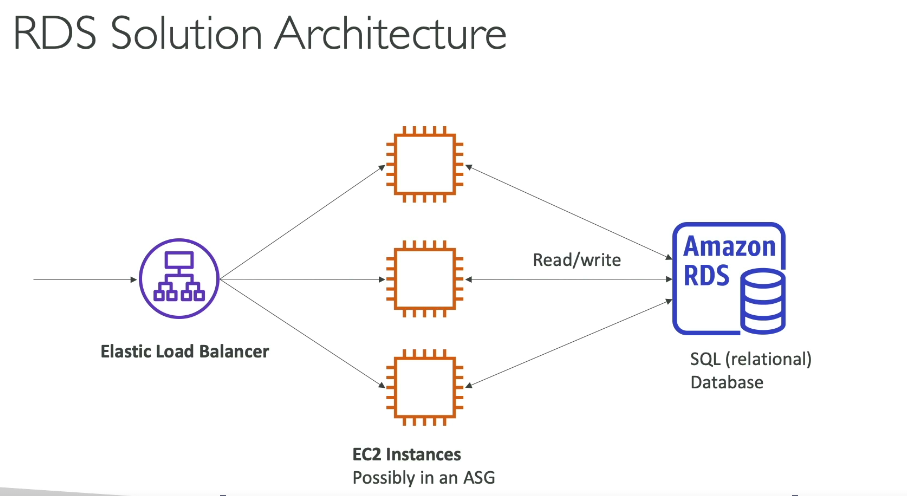
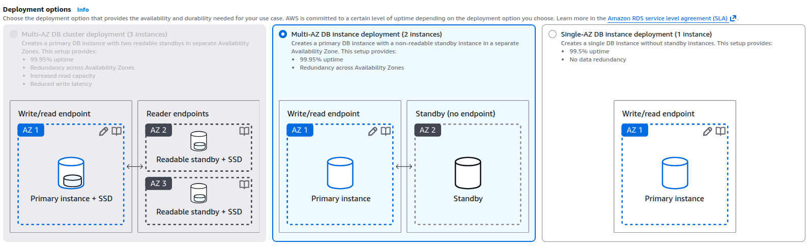

# RDS - Relational Database Service

- Managed DB service for databases that use SQL
- Supports multiple database engines: MySQL, PostgreSQL, Oracle, SQL Server, MariaDB
- Features
  - Automatic provisioning and patching
  - Backup and recovery
  - Read Replicas for read scalability
  - Multi-AZ deployments for high availability
  - Scaling up vertically (instance size) and horizontally (read replicas)
- Storage Backed by EBS

## RDS Deployment Options

- Single-AZ DB instance deployment
- Multi-AZ DB instance deployment
- Multi-AZ DB Cluster deployment

  
