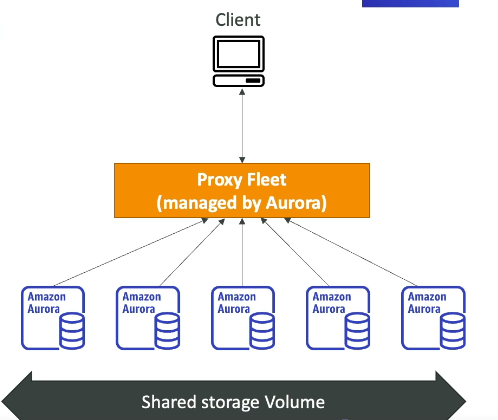

# Amazon Aurora

- not open source, but compatible with MySQL and PostgreSQL
- AWS cloud optimized relational database
- 5X performance of MySQL on RDS, 3X performance of PostgreSQL on RDS
- Cost more than RDS

## Amazon Aurora Serverless

- on-demand, auto-scaling configuration for Aurora
- PostgreSQL and MySQL compatible
- Pay per second for database capacity, based on the actual consumption

