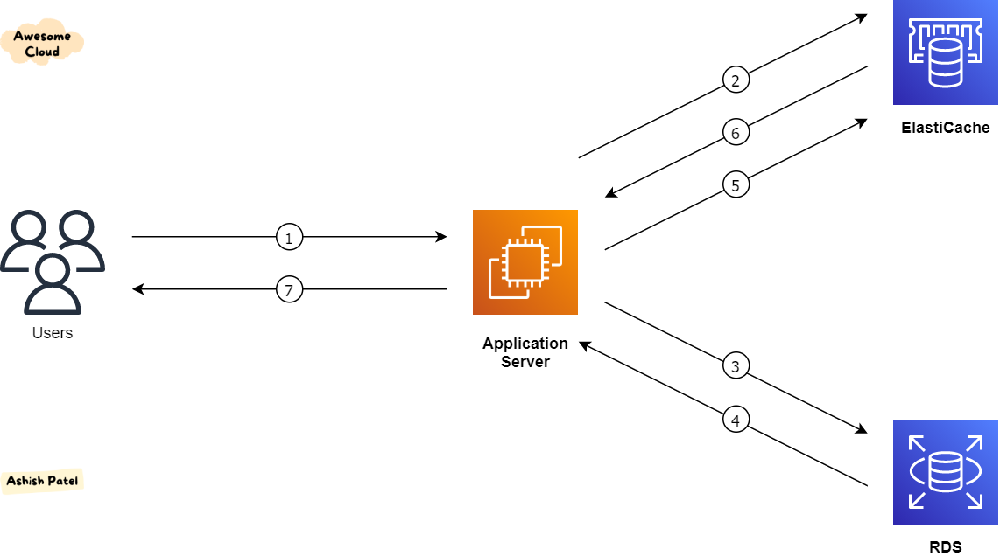

# AWS ElastiCache

- aws managed in-memory cache service
- supports Redis and Memcached

## Why caching is needed

- Users request data (e.g., profile, products)
- App fetches from database every time → slow + expensive
- So we introduce a cache layer:
  - 👉 First check cache
  - 👉 If found → return instantly
  - 👉 If not → fetch from DB and store in cache

