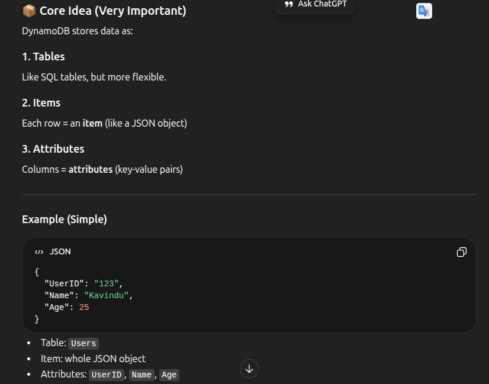
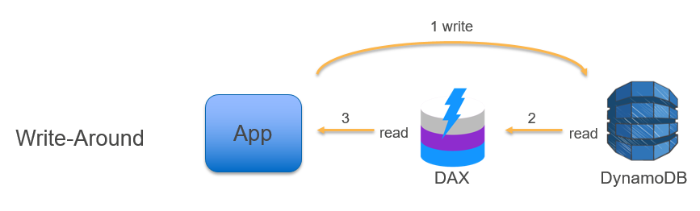

# DynamoDB

- Nosql
- Key-value store
- serverless
- Automatic scaling
- Single digit millisecond latency

## DyanmoDB Table

## DynamoDB Accelerators - DAX

- In-memory cache for DynamoDB
- Reduces response times from milliseconds to microseconds

