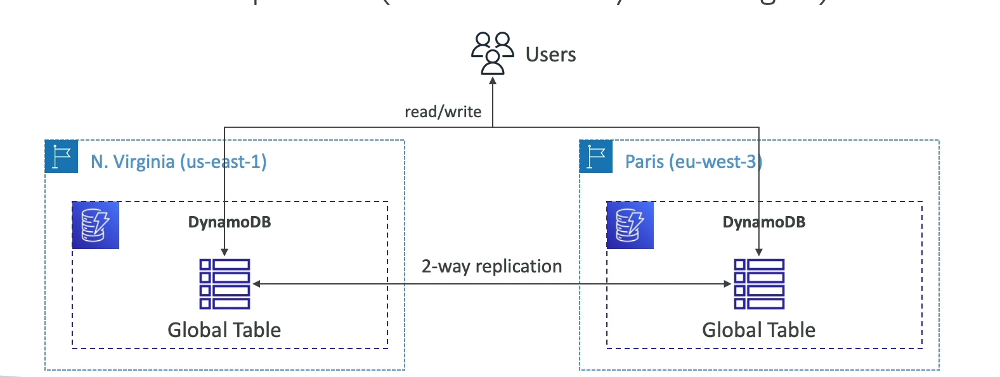

# DynamoDB

- Nosql
- region specific
- Key-value store
- serverless
- Automatic scaling
- Single digit millisecond latency

## DyanmoDB Table

## DynamoDB Accelerators - DAX

- In-memory cache for DynamoDB
- Reduces response times from milliseconds to microseconds

## DynamoDB Global Tables

- Multi-region, fully replicated tables
- Provides high availability and low latency access to data globally
- Active-active replication (read and write operations can be performed in any region)

