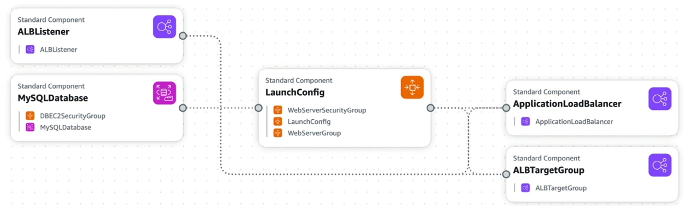

# CloudFormation

- iaC tool provided by AWS
- allows you to define and provision AWS infrastructure using a declarative template
- templates: A template is just a text file that describes your infrastructure, written in JSON or YAML format
- stack: a collection of AWS resources that you can manage as a single unit (a running instance of your template)

## benefits of CloudFormation

- automation: you can automate the provisioning and management of your AWS resources, reducing manual effort and minimizing errors
- version control: you can version control your CloudFormation templates, allowing you to track changes and collaborate with others
- cost management: resources within a stack is tagged with the stack name, making it easier to track and manage costs associated with your infrastructure
- scheduling: you can schedule the creation, update, or deletion of stacks, allowing you to automate infrastructure changes based on specific timeframes or events

---

## Cloudformation + infrastructure composer

- You can use Infrastructure Composer to visualize, build, and deploy modern applications from all AWS services that are supported by AWS CloudFormation.
- we can see resources and their relationships in a visual graph, making it easier to understand and manage complex infrastructures

