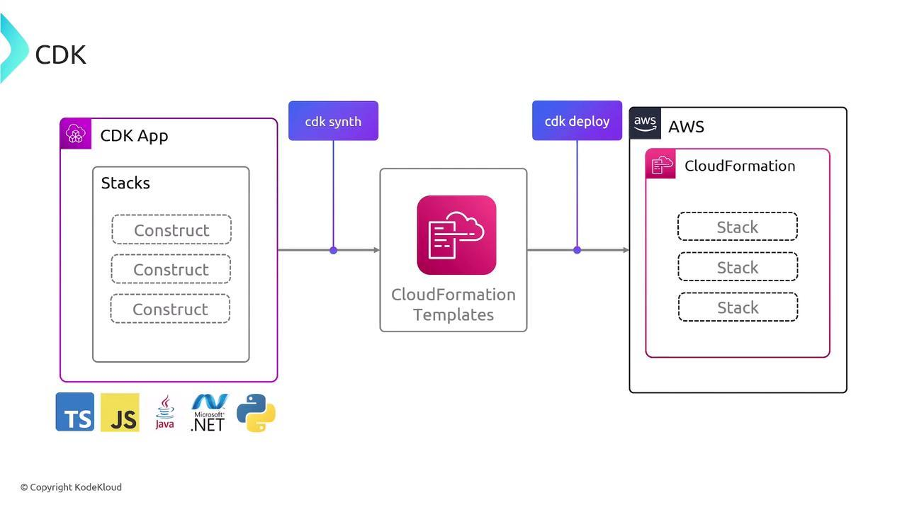

# AWS Cloud Development Kit (CDK)

- write infrastructure using programming languages instead of YAML or JSON
- supports TypeScript, JavaScript, Python, Java, C#

So instead of this (CloudFormation YAML):

```yaml
Resources:
  MyBucket:
    Type: AWS::S3::Bucket
```

You can write this (CDK in TypeScript):

```typescript
new s3.Bucket(this, "MyBucket");
```

- 👉 CDK is a higher-level abstraction on top of AWS CloudFormation

Flow:

- You write CDK code
- CDK converts it → CloudFormation template (this step is called “synth”)
- CloudFormation deploys it


